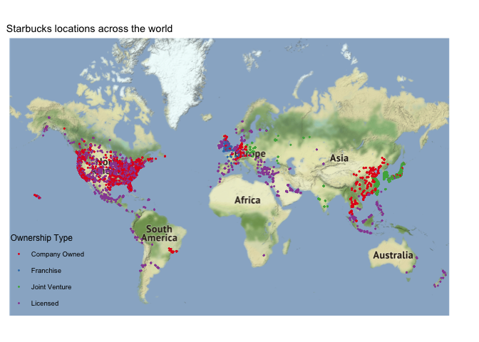
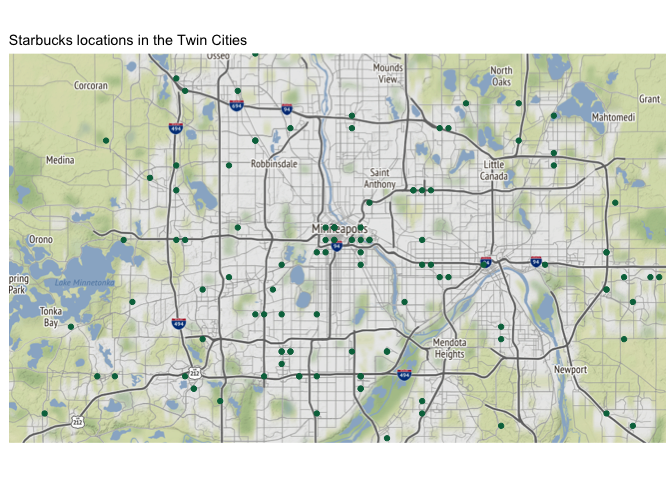
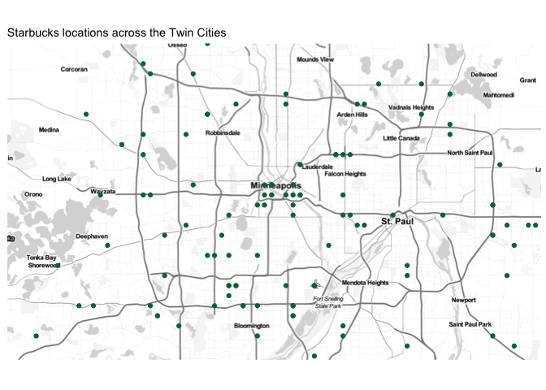
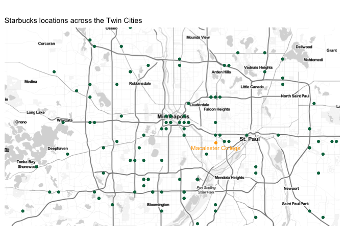
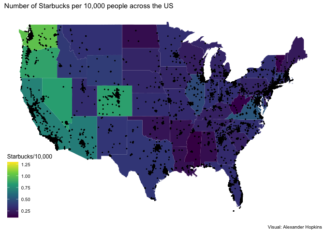
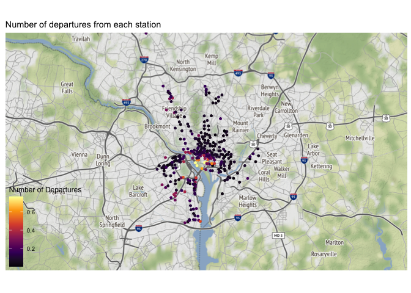
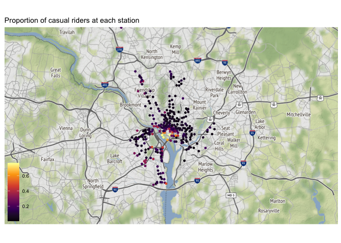

```r
library(tidyverse)     # for data cleaning and plotting
```

```
## ── Attaching packages ─────────────────────────────────────── tidyverse 1.3.0 ──
```

```
## ✓ ggplot2 3.3.3     ✓ purrr   0.3.4
## ✓ tibble  3.0.5     ✓ dplyr   1.0.3
## ✓ tidyr   1.1.2     ✓ stringr 1.4.0
## ✓ readr   1.4.0     ✓ forcats 0.5.0
```

```
## ── Conflicts ────────────────────────────────────────── tidyverse_conflicts() ──
## x dplyr::filter() masks stats::filter()
## x dplyr::lag()    masks stats::lag()
```

```r
library(lubridate)     # for date manipulation
```

```
## 
## Attaching package: 'lubridate'
```

```
## The following objects are masked from 'package:base':
## 
##     date, intersect, setdiff, union
```

```r
library(openintro)     # for the abbr2state() function
```

```
## Loading required package: airports
```

```
## Loading required package: cherryblossom
```

```
## Loading required package: usdata
```

```r
library(palmerpenguins)# for Palmer penguin data
library(maps)          # for map data
```

```
## 
## Attaching package: 'maps'
```

```
## The following object is masked from 'package:purrr':
## 
##     map
```

```r
library(ggmap)         # for mapping points on maps
```

```
## Google's Terms of Service: https://cloud.google.com/maps-platform/terms/.
```

```
## Please cite ggmap if you use it! See citation("ggmap") for details.
```

```r
library(gplots)        # for col2hex() function
```

```
## 
## Attaching package: 'gplots'
```

```
## The following object is masked from 'package:stats':
## 
##     lowess
```

```r
library(RColorBrewer)  # for color palettes
library(sf)            # for working with spatial data
```

```
## Linking to GEOS 3.8.1, GDAL 3.1.4, PROJ 6.3.1
```

```r
library(leaflet)       # for highly customizable mapping
library(carData)       # for Minneapolis police stops data
library(ggthemes)      # for more themes (including theme_map())
theme_set(theme_minimal())
```


```r
# Starbucks locations
Starbucks <- read_csv("https://www.macalester.edu/~ajohns24/Data/Starbucks.csv")
```

```
## 
## ── Column specification ────────────────────────────────────────────────────────
## cols(
##   Brand = col_character(),
##   `Store Number` = col_character(),
##   `Store Name` = col_character(),
##   `Ownership Type` = col_character(),
##   `Street Address` = col_character(),
##   City = col_character(),
##   `State/Province` = col_character(),
##   Country = col_character(),
##   Postcode = col_character(),
##   `Phone Number` = col_character(),
##   Timezone = col_character(),
##   Longitude = col_double(),
##   Latitude = col_double()
## )
```

```r
starbucks_us_by_state <- Starbucks %>% 
  filter(Country == "US") %>% 
  count(`State/Province`) %>% 
  mutate(state_name = str_to_lower(abbr2state(`State/Province`))) 

# Lisa's favorite St. Paul places - example for you to create your own data
favorite_stp_by_lisa <- tibble(
  place = c("Home", "Macalester College", "Adams Spanish Immersion", 
            "Spirit Gymnastics", "Bama & Bapa", "Now Bikes",
            "Dance Spectrum", "Pizza Luce", "Brunson's"),
  long = c(-93.1405743, -93.1712321, -93.1451796, 
           -93.1650563, -93.1542883, -93.1696608, 
           -93.1393172, -93.1524256, -93.0753863),
  lat = c(44.950576, 44.9378965, 44.9237914,
          44.9654609, 44.9295072, 44.9436813, 
          44.9399922, 44.9468848, 44.9700727)
  )

#COVID-19 data from the New York Times
covid19 <- read_csv("https://raw.githubusercontent.com/nytimes/covid-19-data/master/us-states.csv")
```

```
## 
## ── Column specification ────────────────────────────────────────────────────────
## cols(
##   date = col_date(format = ""),
##   state = col_character(),
##   fips = col_character(),
##   cases = col_double(),
##   deaths = col_double()
## )
```

## Put your homework on GitHub!

If you were not able to get set up on GitHub last week, go [here](https://github.com/llendway/github_for_collaboration/blob/master/github_for_collaboration.md) and get set up first. Then, do the following (if you get stuck on a step, don't worry, I will help! You can always get started on the homework and we can figure out the GitHub piece later):

* Create a repository on GitHub, giving it a nice name so you know it is for the 4th weekly exercise assignment (follow the instructions in the document/video).  
* Copy the repo name so you can clone it to your computer. In R Studio, go to file --> New project --> Version control --> Git and follow the instructions from the document/video.  
* Download the code from this document and save it in the repository folder/project on your computer.  
* In R Studio, you should then see the .Rmd file in the upper right corner in the Git tab (along with the .Rproj file and probably .gitignore).  
* Check all the boxes of the files in the Git tab under Stage and choose commit.  
* In the commit window, write a commit message, something like "Initial upload" would be appropriate, and commit the files.  
* Either click the green up arrow in the commit window or close the commit window and click the green up arrow in the Git tab to push your changes to GitHub.  
* Refresh your GitHub page (online) and make sure the new documents have been pushed out.  
* Back in R Studio, knit the .Rmd file. When you do that, you should have two (as long as you didn't make any changes to the .Rmd file, in which case you might have three) files show up in the Git tab - an .html file and an .md file. The .md file is something we haven't seen before and is here because I included `keep_md: TRUE` in the YAML heading. The .md file is a markdown (NOT R Markdown) file that is an interim step to creating the html file. They are displayed fairly nicely in GitHub, so we want to keep it and look at it there. Click the boxes next to these two files, commit changes (remember to include a commit message), and push them (green up arrow).  
* As you work through your homework, save and commit often, push changes occasionally (maybe after you feel finished with an exercise?), and go check to see what the .md file looks like on GitHub.  
* If you have issues, let me know! This is new to many of you and may not be intuitive at first. But, I promise, you'll get the hang of it! 


## Instructions

* Put your name at the top of the document. 

* **For ALL graphs, you should include appropriate labels.** 

* Feel free to change the default theme, which I currently have set to `theme_minimal()`. 

* Use good coding practice. Read the short sections on good code with [pipes](https://style.tidyverse.org/pipes.html) and [ggplot2](https://style.tidyverse.org/ggplot2.html). **This is part of your grade!**

* When you are finished with ALL the exercises, uncomment the options at the top so your document looks nicer. Don't do it before then, or else you might miss some important warnings and messages.


## Warm-up exercises from tutorial

These exercises will reiterate what you learned in the "Mapping data with R" tutorial. If you haven't gone through the tutorial yet, you should do that first.

### Starbucks locations (`ggmap`)

  1. Add the `Starbucks` locations to a world map. Add an aesthetic to the world map that sets the color of the points according to the ownership type. What, if anything, can you deduce from this visualization?  
  

```r
world_map <- get_stamenmap(
    bbox = c(left = -182.5, bottom = -60.4, right = 200.7, top = 81.8), 
    maptype = "terrain",
    zoom = 2)
```

```
## Source : http://tile.stamen.com/terrain/2/-1/0.png
```

```
## Service Unavailable (HTTP 503). Failed to aquire tile /terrain/2/-1/0.png.
## Source : http://tile.stamen.com/terrain/2/0/0.png
## Source : http://tile.stamen.com/terrain/2/1/0.png
## Source : http://tile.stamen.com/terrain/2/2/0.png
## Source : http://tile.stamen.com/terrain/2/3/0.png
## Source : http://tile.stamen.com/terrain/2/4/0.png
## Not Found (HTTP 404). Failed to aquire tile /terrain/2/4/0.png.
## Source : http://tile.stamen.com/terrain/2/-1/1.png
## Service Unavailable (HTTP 503). Failed to aquire tile /terrain/2/-1/1.png.
## Source : http://tile.stamen.com/terrain/2/0/1.png
## Source : http://tile.stamen.com/terrain/2/1/1.png
## Source : http://tile.stamen.com/terrain/2/2/1.png
## Source : http://tile.stamen.com/terrain/2/3/1.png
## Source : http://tile.stamen.com/terrain/2/4/1.png
## Not Found (HTTP 404). Failed to aquire tile /terrain/2/4/1.png.
## Source : http://tile.stamen.com/terrain/2/-1/2.png
## Service Unavailable (HTTP 503). Failed to aquire tile /terrain/2/-1/2.png.
## Source : http://tile.stamen.com/terrain/2/0/2.png
## Source : http://tile.stamen.com/terrain/2/1/2.png
## Source : http://tile.stamen.com/terrain/2/2/2.png
## Source : http://tile.stamen.com/terrain/2/3/2.png
## Source : http://tile.stamen.com/terrain/2/4/2.png
## Not Found (HTTP 404). Failed to aquire tile /terrain/2/4/2.png.
```


```r
ggmap(world_map) +
  geom_point(data = Starbucks, 
            aes(x = Longitude, y = Latitude, color = `Ownership Type`),
            size = .3) +
  scale_color_viridis_d() +
  theme_map() +
  theme(legend.background = element_blank(),
        legend.key = element_rect("grey50")) +
  labs(title = "Starbucks locations across the world")
```

```
## Warning: Removed 1 rows containing missing values (geom_point).
```

<!-- -->

The vast majority of Starbucks franchises are in North America, there are a decent amount in Europe and far-East Asia, there are only a couple in Africa and Australia. An overwhelming number of the Starbucks are either licensed or company owned. Noticeably almost all of the Starbucks in Japan and Korea are Joint Ventures. 

  2. Construct a new map of Starbucks locations in the Twin Cities metro area (approximately the 5 county metro area).  


```r
twin_cities_map <- get_stamenmap(
    bbox = c(left = -93.6406, bottom = 44.8062, right = -92.8922, top = 45.1201), 
    maptype = "terrain",
    zoom = 11)
```

```
## Source : http://tile.stamen.com/terrain/11/491/735.png
```

```
## Source : http://tile.stamen.com/terrain/11/492/735.png
```

```
## Source : http://tile.stamen.com/terrain/11/493/735.png
```

```
## Source : http://tile.stamen.com/terrain/11/494/735.png
```

```
## Source : http://tile.stamen.com/terrain/11/495/735.png
```

```
## Source : http://tile.stamen.com/terrain/11/491/736.png
```

```
## Source : http://tile.stamen.com/terrain/11/492/736.png
```

```
## Source : http://tile.stamen.com/terrain/11/493/736.png
```

```
## Source : http://tile.stamen.com/terrain/11/494/736.png
```

```
## Source : http://tile.stamen.com/terrain/11/495/736.png
```

```
## Source : http://tile.stamen.com/terrain/11/491/737.png
```

```
## Source : http://tile.stamen.com/terrain/11/492/737.png
```

```
## Source : http://tile.stamen.com/terrain/11/493/737.png
```

```
## Source : http://tile.stamen.com/terrain/11/494/737.png
```

```
## Source : http://tile.stamen.com/terrain/11/495/737.png
```

```
## Source : http://tile.stamen.com/terrain/11/491/738.png
```

```
## Source : http://tile.stamen.com/terrain/11/492/738.png
```

```
## Source : http://tile.stamen.com/terrain/11/493/738.png
```

```
## Source : http://tile.stamen.com/terrain/11/494/738.png
```

```
## Source : http://tile.stamen.com/terrain/11/495/738.png
```


```r
ggmap(twin_cities_map) +
  geom_point(data = Starbucks %>% filter(`State/Province` == "MN"), 
            aes(x = Longitude, y = Latitude),
            color = "#00704A") +
  scale_color_viridis_d() +
  theme_map() +
  theme(legend.background = element_blank()) +
  labs(title = "Starbucks locations in the Twin Cities")
```

```
## Warning: Removed 74 rows containing missing values (geom_point).
```

<!-- -->

  3. In the Twin Cities plot, play with the zoom number. What does it do?  (just describe what it does - don't actually include more than one map).  
  
  If I zoom out it loads a lot faster but there is less detail. I can't see where each Starbucks is. Also the city labels are very large, they are almost distorted. The latitude and longitude stay the same, it just zooms in within those limits.

  4. Try a couple different map types (see `get_stamenmap()` in help and look at `maptype`). Include a map with one of the other map types. 
  

```r
twin_cities_map_toner <- get_stamenmap(
    bbox = c(left = -93.6406, bottom = 44.8062, right = -92.8922, top = 45.1201), 
    maptype = "toner-lite",
    zoom = 11)
```

```
## Source : http://tile.stamen.com/toner-lite/11/491/735.png
```

```
## Source : http://tile.stamen.com/toner-lite/11/492/735.png
```

```
## Source : http://tile.stamen.com/toner-lite/11/493/735.png
```

```
## Source : http://tile.stamen.com/toner-lite/11/494/735.png
```

```
## Source : http://tile.stamen.com/toner-lite/11/495/735.png
```

```
## Source : http://tile.stamen.com/toner-lite/11/491/736.png
```

```
## Source : http://tile.stamen.com/toner-lite/11/492/736.png
```

```
## Source : http://tile.stamen.com/toner-lite/11/493/736.png
```

```
## Source : http://tile.stamen.com/toner-lite/11/494/736.png
```

```
## Source : http://tile.stamen.com/toner-lite/11/495/736.png
```

```
## Source : http://tile.stamen.com/toner-lite/11/491/737.png
```

```
## Source : http://tile.stamen.com/toner-lite/11/492/737.png
```

```
## Source : http://tile.stamen.com/toner-lite/11/493/737.png
```

```
## Source : http://tile.stamen.com/toner-lite/11/494/737.png
```

```
## Source : http://tile.stamen.com/toner-lite/11/495/737.png
```

```
## Source : http://tile.stamen.com/toner-lite/11/491/738.png
```

```
## Source : http://tile.stamen.com/toner-lite/11/492/738.png
```

```
## Source : http://tile.stamen.com/toner-lite/11/493/738.png
```

```
## Source : http://tile.stamen.com/toner-lite/11/494/738.png
```

```
## Source : http://tile.stamen.com/toner-lite/11/495/738.png
```

```r
ggmap(twin_cities_map_toner) +
  geom_point(data = Starbucks %>% filter(`State/Province` == "MN"), 
            aes(x = Longitude, y = Latitude),
            color = "#00704A") +
  scale_color_viridis_d() +
  theme_map() +
  theme(legend.background = element_blank()) +
  labs(title = "Starbucks locations across the Twin Cities")
```

```
## Warning: Removed 74 rows containing missing values (geom_point).
```

<!-- -->
  

  5. Add a point to the map that indicates Macalester College and label it appropriately. There are many ways you can do think, but I think it's easiest with the `annotate()` function (see `ggplot2` cheatsheet).
  

```r
ggmap(twin_cities_map_toner) +
  geom_point(data = Starbucks %>% filter(`State/Province` == "MN"), 
            aes(x = Longitude, y = Latitude),
            color = "#00704A") +
  annotate(geom = "point", x =-93.1691 , y = 44.9379, color = "orange") +
  annotate(geom = "text", x =-93.1691 , y = 44.9379 - 0.0075, 
           label = "Macalester College", color = "orange", size = 3) +
  scale_color_viridis_d() +
  theme_map() +
  theme(legend.background = element_blank()) +
  labs(title = "Starbucks locations across the Twin Cities")
```

```
## Warning: Removed 74 rows containing missing values (geom_point).
```

<!-- -->
  

### Choropleth maps with Starbucks data (`geom_map()`)

The example I showed in the tutorial did not account for population of each state in the map. In the code below, a new variable is created, `starbucks_per_10000`, that gives the number of Starbucks per 10,000 people. It is in the `starbucks_with_2018_pop_est` dataset.


```r
census_pop_est_2018 <- read_csv("https://www.dropbox.com/s/6txwv3b4ng7pepe/us_census_2018_state_pop_est.csv?dl=1") %>% 
  separate(state, into = c("dot","state"), extra = "merge") %>% 
  select(-dot) %>% 
  mutate(state = str_to_lower(state))
```

```
## 
## ── Column specification ────────────────────────────────────────────────────────
## cols(
##   state = col_character(),
##   est_pop_2018 = col_double()
## )
```

```r
starbucks_with_2018_pop_est <-
  starbucks_us_by_state %>% 
  left_join(census_pop_est_2018,
            by = c("state_name" = "state")) %>% 
  mutate(starbucks_per_10000 = (n/est_pop_2018)*10000)
```

  6. **`dplyr` review**: Look through the code above and describe what each line of code does.

1 - Loads a csv file from dropbox and renames the resulting data frame 'census_pop_est_2018'  
2 - In the original file, the state names have a dot in front of them, this separates that into a dot variable and a state variable (without the dot). The extra controls what to do if there are too many pieces.  
3 - Selects everything except the dot column  
4 - Creates a new state column (overwrites the old one), where the state names are now lowercase  
5 - blank  
6 - Renames the resulting data frame 'starbucks_with_2018_pop_est'  
7 - Tells R to use the 'starbucks_us_by_state' data frame  
8 - Joins the Starbucks data with the census data from above, by the state name  
9 - Creates a new variable 'starbucks_per_10000' which is the number of starbucks divided by the population multiplied by 10,000  

  7. Create a choropleth map that shows the number of Starbucks per 10,000 people on a map of the US. Use a new fill color, add points for all Starbucks in the US (except Hawaii and Alaska), add an informative title for the plot, and include a caption that says who created the plot (you!). Make a conclusion about what you observe.
  

```r
us_map <- map_data("state")

starbucks_with_2018_pop_est %>% 
  ggplot() +
  geom_map(map = us_map,
           aes(map_id = state_name,
               fill = starbucks_per_10000)) +
  geom_point(data = Starbucks %>% filter(Country == "US", `State/Province` != "HI", `State/Province` != "AK"),
             aes(x = Longitude,
             y = Latitude),
             size = .25) +
  expand_limits(x = us_map$long, y = us_map$lat) + 
  theme_map() +
  labs(title = "Number of Starbucks per 10,000 people across the US",
       caption = "Visual: Alexander Hopkins",
       fill = "Starbucks/10,000") +
  scale_fill_viridis_c() +
  theme(legend.background = element_blank())
```

<!-- -->
  
  The Western States have more Starbucks per 10,000 people than other parts of the country. The East Coast appears to have a lot of Starbucks but they are spread over different states. West Virginia, Mississippi and Vermont have the fewest Starbucks per 10,000.

### A few of your favorite things (`leaflet`)

  8. In this exercise, you are going to create a single map of some of your favorite places! The end result will be one map that satisfies the criteria below. 

  * Create a data set using the `tibble()` function that has 10-15 rows of your favorite places. The columns will be the name of the location, the latitude, the longitude, and a column that indicates if it is in your top 3 favorite locations or not. For an example of how to use `tibble()`, look at the `favorite_stp_by_lisa` I created in the data R code chunk at the beginning.  
  

```r
fav_plaes <- tibble(
  place = c("Home", "Macalester College", "Adams Spanish Immersion", 
            "Spirit Gymnastics", "Bama & Bapa", "Now Bikes",
            "Dance Spectrum", "Pizza Luce", "Brunson's"),
  long = c(-93.1405743, -93.1712321, -93.1451796, 
           -93.1650563, -93.1542883, -93.1696608, 
           -93.1393172, -93.1524256, -93.0753863),
  lat = c(44.950576, 44.9378965, 44.9237914,
          44.9654609, 44.9295072, 44.9436813, 
          44.9399922, 44.9468848, 44.9700727)
  )
```

  * Create a `leaflet` map that uses circles to indicate your favorite places. Label them with the name of the place. Choose the base map you like best. Color your 3 favorite places differently than the ones that are not in your top 3 (HINT: `colorFactor()`). Add a legend that explains what the colors mean.  
  
  * Connect all your locations together with a line in a meaningful way (you may need to order them differently in the original data).  
  
  * If there are other variables you want to add that could enhance your plot, do that now.  
  
## Revisiting old datasets

This section will revisit some datasets we have used previously and bring in a mapping component. 

### Bicycle-Use Patterns

The data come from Washington, DC and cover the last quarter of 2014.

Two data tables are available:

- `Trips` contains records of individual rentals
- `Stations` gives the locations of the bike rental stations

Here is the code to read in the data. We do this a little differently than usualy, which is why it is included here rather than at the top of this file. To avoid repeatedly re-reading the files, start the data import chunk with `{r cache = TRUE}` rather than the usual `{r}`. This code reads in the large dataset right away.


```r
data_site <- 
  "https://www.macalester.edu/~dshuman1/data/112/2014-Q4-Trips-History-Data.rds" 
Trips <- readRDS(gzcon(url(data_site)))
Stations<-read_csv("http://www.macalester.edu/~dshuman1/data/112/DC-Stations.csv")
```

```
## 
## ── Column specification ────────────────────────────────────────────────────────
## cols(
##   name = col_character(),
##   lat = col_double(),
##   long = col_double(),
##   nbBikes = col_double(),
##   nbEmptyDocks = col_double()
## )
```

  9. Use the latitude and longitude variables in `Stations` to make a visualization of the total number of departures from each station in the `Trips` data. Use either color or size to show the variation in number of departures. This time, plot the points on top of a map. Use any of the mapping tools you'd like.

```r
dc_map <- get_stamenmap(
    bbox = c(left = -77.4032, bottom = 38.7319, right = -76.6547, top = 39.0771), 
    maptype = "terrain",
    zoom = 11)
```

```
## Source : http://tile.stamen.com/terrain/11/583/782.png
```

```
## Source : http://tile.stamen.com/terrain/11/584/782.png
```

```
## Source : http://tile.stamen.com/terrain/11/585/782.png
```

```
## Source : http://tile.stamen.com/terrain/11/586/782.png
```

```
## Source : http://tile.stamen.com/terrain/11/587/782.png
```

```
## Source : http://tile.stamen.com/terrain/11/583/783.png
```

```
## Source : http://tile.stamen.com/terrain/11/584/783.png
```

```
## Source : http://tile.stamen.com/terrain/11/585/783.png
```

```
## Source : http://tile.stamen.com/terrain/11/586/783.png
```

```
## Source : http://tile.stamen.com/terrain/11/587/783.png
```

```
## Source : http://tile.stamen.com/terrain/11/583/784.png
```

```
## Source : http://tile.stamen.com/terrain/11/584/784.png
```

```
## Source : http://tile.stamen.com/terrain/11/585/784.png
```

```
## Source : http://tile.stamen.com/terrain/11/586/784.png
```

```
## Source : http://tile.stamen.com/terrain/11/587/784.png
```
  
  

```r
trip_station <- Trips %>% 
  group_by(sstation) %>% 
  summarise(num_departures = n()) %>% 
  left_join(Stations, by = c("sstation" = "name"))

ggmap(dc_map) +
  geom_point(data = trip_station, 
            aes(x = long, y = lat, color = num_departures), size = 1) +
  scale_color_viridis_c(option = "inferno") +
  theme_map() +
  theme(legend.background = element_blank()) +
  labs(title = "Number of departures from each station",
       x = "",
       y = "",
       color = "Number of Departures")
```

```
## Warning: Removed 32 rows containing missing values (geom_point).
```

<!-- -->
  
  10. Only 14.4% of the trips in our data are carried out by casual users. Create a plot that shows which area(s) have stations with a much higher percentage of departures by casual users. What patterns do you notice? Also plot this on top of a map. I think it will be more clear what the patterns are.
  

```r
trip_station_prop <- Trips %>% 
  group_by(sstation, client) %>% 
  summarise(num_departures = n()) %>% 
  mutate(total_departures = sum(num_departures),
         percent_casual = ifelse(client == "Casual", num_departures/total_departures, 0)) %>% 
  filter(percent_casual != 0) %>% 
  left_join(Stations, by = c("sstation" = "name"))
```

```
## `summarise()` has grouped output by 'sstation'. You can override using the `.groups` argument.
```

```r
ggmap(dc_map) +
  geom_point(data = trip_station_prop, 
            aes(x = long, y = lat, color = percent_casual), size = 1) +
  scale_color_viridis_c(option = "inferno") +
  theme_map() +
  theme(legend.background = element_blank()) +
  labs(title = "Number of departures from each station",
       x = "",
       y = "",
       color = "Number of Departures")
```

```
## Warning: Removed 32 rows containing missing values (geom_point).
```

<!-- -->
  
  The locations with the highest proportion of casual riders are all around the National Mall. This suggests that they could be tourists, borrowing the bikes for a day of site seeing.
  
### COVID-19 data

The following exercises will use the COVID-19 data from the NYT.

  11. Create a map that colors the states by the most recent cumulative number of COVID-19 cases (remember, these data report cumulative numbers so you don't need to compute that). Describe what you see. What is the problem with this map?

```r
options(scipen = 7)
covid19 %>% 
  group_by(state) %>% 
  mutate(state = str_to_lower(state)) %>% 
  filter(date == max(date)) %>% 
  ggplot() +
  geom_map(map = us_map,
           aes(map_id = state,
               fill = cases)) +
  expand_limits(x = us_map$long, y = us_map$lat) + 
  theme_map() +
  labs(title = "COVID 19 Cases by State",
       fill = "") +
  scale_fill_viridis_c() +
  theme(legend.background = element_blank())
```

<!-- -->
  
  The problem with this map is it is not weighted by population. The biggest states (California, Texas) have more cases, but a lot of this is becasue there are more people living in those states.
  
  12. Now add the population of each state to the dataset and color the states by most recent cumulative cases/10,000 people. See the code for doing this with the Starbucks data. You will need to make some modifications. 
  

```r
options(scipen = 7)

covid_with_2018_pop_est <-
  covid19 %>% 
  group_by(state) %>% 
  mutate(state = str_to_lower(state)) %>% 
  filter(date == max(date)) %>% 
  left_join(census_pop_est_2018, by = "state") %>% 
  mutate(cases_per_10000 = (cases/est_pop_2018)*10000)

covid_with_2018_pop_est %>% 
  ggplot() +
  geom_map(map = us_map,
           aes(map_id = state,
               fill = cases_per_10000)) +
  expand_limits(x = us_map$long, y = us_map$lat) + 
  theme_map() +
  labs(title = "COVID19 cases per 10,000 by state",
       fill = "") +
  scale_fill_viridis_c() +
  theme(legend.background = element_blank())
```

<!-- -->
  
  13. **CHALLENGE** Choose 4 dates spread over the time period of the data and create the same map as in exercise 12 for each of the dates. Display the four graphs together using faceting. What do you notice?
  
## Minneapolis police stops

These exercises use the datasets `MplsStops` and `MplsDemo` from the `carData` library. Search for them in Help to find out more information.

  14. Use the `MplsStops` dataset to find out how many stops there were for each neighborhood and the proportion of stops that were for a suspicious vehicle or person. Sort the results from most to least number of stops. Save this as a dataset called `mpls_suspicious` and display the table.  
  

```r
mpls_suspicious <- MplsStops %>% 
  group_by(neighborhood, problem) %>% 
  summarize(num = n()) %>% 
  pivot_wider(id_cols = neighborhood:num,
              names_from = "problem",
              values_from = "num") %>% 
  mutate(total_stops = suspicious+traffic,
          prop_sus = suspicious/total_stops) %>% 
  arrange(desc(total_stops))
```

```
## `summarise()` has grouped output by 'neighborhood'. You can override using the `.groups` argument.
```

```r
mpls_suspicious
```

<div data-pagedtable="false">
  <script data-pagedtable-source type="application/json">
{"columns":[{"label":["neighborhood"],"name":[1],"type":["fct"],"align":["left"]},{"label":["suspicious"],"name":[2],"type":["int"],"align":["right"]},{"label":["traffic"],"name":[3],"type":["int"],"align":["right"]},{"label":["total_stops"],"name":[4],"type":["int"],"align":["right"]},{"label":["prop_sus"],"name":[5],"type":["dbl"],"align":["right"]}],"data":[{"1":"Downtown West","2":"3338","3":"1071","4":"4409","5":"0.7570878"},{"1":"Whittier","2":"1351","3":"1977","4":"3328","5":"0.4059495"},{"1":"Near - North","2":"937","3":"1319","4":"2256","5":"0.4153369"},{"1":"Lyndale","2":"872","3":"1282","4":"2154","5":"0.4048282"},{"1":"Jordan","2":"813","3":"1262","4":"2075","5":"0.3918072"},{"1":"Hawthorne","2":"785","3":"1246","4":"2031","5":"0.3865091"},{"1":"Marcy Holmes","2":"517","3":"1281","4":"1798","5":"0.2875417"},{"1":"Lowry Hill East","2":"603","3":"888","4":"1491","5":"0.4044266"},{"1":"East Phillips","2":"959","3":"428","4":"1387","5":"0.6914203"},{"1":"Folwell","2":"485","3":"745","4":"1230","5":"0.3943089"},{"1":"Willard - Hay","2":"532","3":"675","4":"1207","5":"0.4407622"},{"1":"Holland","2":"319","3":"850","4":"1169","5":"0.2728828"},{"1":"Ventura Village","2":"766","3":"330","4":"1096","5":"0.6989051"},{"1":"Powderhorn Park","2":"746","3":"309","4":"1055","5":"0.7071090"},{"1":"Midtown Phillips","2":"767","3":"252","4":"1019","5":"0.7526987"},{"1":"Steven's Square - Loring Heights","2":"447","3":"559","4":"1006","5":"0.4443340"},{"1":"Nicollet Island - East Bank","2":"163","3":"782","4":"945","5":"0.1724868"},{"1":"King Field","2":"249","3":"597","4":"846","5":"0.2943262"},{"1":"Central","2":"528","3":"304","4":"832","5":"0.6346154"},{"1":"Cedar Riverside","2":"563","3":"262","4":"825","5":"0.6824242"},{"1":"North Loop","2":"333","3":"466","4":"799","5":"0.4167710"},{"1":"McKinley","2":"315","3":"457","4":"772","5":"0.4080311"},{"1":"Loring Park","2":"548","3":"193","4":"741","5":"0.7395412"},{"1":"Phillips West","2":"466","3":"260","4":"726","5":"0.6418733"},{"1":"Webber - Camden","2":"385","3":"271","4":"656","5":"0.5868902"},{"1":"Longfellow","2":"441","3":"162","4":"603","5":"0.7313433"},{"1":"Prospect Park - East River Road","2":"210","3":"384","4":"594","5":"0.3535354"},{"1":"CARAG","2":"234","3":"325","4":"559","5":"0.4186047"},{"1":"Audubon Park","2":"206","3":"348","4":"554","5":"0.3718412"},{"1":"Tangletown","2":"98","3":"449","4":"547","5":"0.1791590"},{"1":"Elliot Park","2":"424","3":"120","4":"544","5":"0.7794118"},{"1":"East Isles","2":"112","3":"418","4":"530","5":"0.2113208"},{"1":"Seward","2":"380","3":"130","4":"510","5":"0.7450980"},{"1":"Victory","2":"265","3":"233","4":"498","5":"0.5321285"},{"1":"St. Anthony West","2":"128","3":"347","4":"475","5":"0.2694737"},{"1":"Windom Park","2":"158","3":"303","4":"461","5":"0.3427332"},{"1":"Como","2":"138","3":"314","4":"452","5":"0.3053097"},{"1":"Windom","2":"183","3":"221","4":"404","5":"0.4529703"},{"1":"Harrison","2":"245","3":"156","4":"401","5":"0.6109726"},{"1":"Bottineau","2":"96","3":"281","4":"377","5":"0.2546419"},{"1":"Corcoran","2":"220","3":"140","4":"360","5":"0.6111111"},{"1":"Cleveland","2":"206","3":"150","4":"356","5":"0.5786517"},{"1":"Logan Park","2":"79","3":"276","4":"355","5":"0.2225352"},{"1":"Marshall Terrace","2":"93","3":"262","4":"355","5":"0.2619718"},{"1":"Lind - Bohanon","2":"272","3":"72","4":"344","5":"0.7906977"},{"1":"Northeast Park","2":"130","3":"196","4":"326","5":"0.3987730"},{"1":"Sheridan","2":"101","3":"217","4":"318","5":"0.3176101"},{"1":"ECCO","2":"188","3":"120","4":"308","5":"0.6103896"},{"1":"Mid - City Industrial","2":"77","3":"201","4":"278","5":"0.2769784"},{"1":"Downtown East","2":"143","3":"119","4":"262","5":"0.5458015"},{"1":"Lynnhurst","2":"86","3":"159","4":"245","5":"0.3510204"},{"1":"Waite Park","2":"144","3":"100","4":"244","5":"0.5901639"},{"1":"Lowry Hill","2":"117","3":"126","4":"243","5":"0.4814815"},{"1":"Hiawatha","2":"161","3":"74","4":"235","5":"0.6851064"},{"1":"Linden Hills","2":"124","3":"94","4":"218","5":"0.5688073"},{"1":"St. Anthony East","2":"66","3":"152","4":"218","5":"0.3027523"},{"1":"University of Minnesota","2":"84","3":"134","4":"218","5":"0.3853211"},{"1":"Standish","2":"180","3":"32","4":"212","5":"0.8490566"},{"1":"Beltrami","2":"53","3":"158","4":"211","5":"0.2511848"},{"1":"Howe","2":"146","3":"50","4":"196","5":"0.7448980"},{"1":"Kenwood","2":"48","3":"145","4":"193","5":"0.2487047"},{"1":"Northrop","2":"172","3":"17","4":"189","5":"0.9100529"},{"1":"East Harriet","2":"80","3":"89","4":"169","5":"0.4733728"},{"1":"Cedar - Isles - Dean","2":"54","3":"99","4":"153","5":"0.3529412"},{"1":"Columbia Park","2":"64","3":"87","4":"151","5":"0.4238411"},{"1":"Diamond Lake","2":"115","3":"34","4":"149","5":"0.7718121"},{"1":"Regina","2":"108","3":"34","4":"142","5":"0.7605634"},{"1":"Ericsson","2":"105","3":"31","4":"136","5":"0.7720588"},{"1":"Bancroft","2":"113","3":"21","4":"134","5":"0.8432836"},{"1":"Shingle Creek","2":"106","3":"26","4":"132","5":"0.8030303"},{"1":"Fulton","2":"90","3":"40","4":"130","5":"0.6923077"},{"1":"Bryn - Mawr","2":"78","3":"47","4":"125","5":"0.6240000"},{"1":"Sumner - Glenwood","2":"70","3":"53","4":"123","5":"0.5691057"},{"1":"Kenny","2":"65","3":"53","4":"118","5":"0.5508475"},{"1":"Keewaydin","2":"105","3":"10","4":"115","5":"0.9130435"},{"1":"Minnehaha","2":"95","3":"18","4":"113","5":"0.8407080"},{"1":"Cooper","2":"56","3":"56","4":"112","5":"0.5000000"},{"1":"Wenonah","2":"101","3":"11","4":"112","5":"0.9017857"},{"1":"Bryant","2":"77","3":"19","4":"96","5":"0.8020833"},{"1":"Field","2":"68","3":"19","4":"87","5":"0.7816092"},{"1":"West Calhoun","2":"45","3":"35","4":"80","5":"0.5625000"},{"1":"Armatage","2":"65","3":"12","4":"77","5":"0.8441558"},{"1":"Morris Park","2":"71","3":"3","4":"74","5":"0.9594595"},{"1":"Hale","2":"48","3":"13","4":"61","5":"0.7868852"},{"1":"Page","2":"32","3":"9","4":"41","5":"0.7804878"},{"1":"Camden Industrial","2":"12","3":"22","4":"34","5":"0.3529412"},{"1":"Humboldt Industrial Area","2":"4","3":"6","4":"10","5":"0.4000000"}],"options":{"columns":{"min":{},"max":[10]},"rows":{"min":[10],"max":[10]},"pages":{}}}
  </script>
</div>
  
  
  15. Use a `leaflet` map and the `MplsStops` dataset to display each of the stops on a map as a small point. Color the points differently depending on whether they were for suspicious vehicle/person or a traffic stop (the `problem` variable). HINTS: use `addCircleMarkers`, set `stroke = FAlSE`, use `colorFactor()` to create a palette.  
  

  
  
  16. Save the folder from moodle called Minneapolis_Neighborhoods into your project/repository folder for this assignment. Make sure the folder is called Minneapolis_Neighborhoods. Use the code below to read in the data and make sure to **delete the `eval=FALSE`**. Although it looks like it only links to the .sph file, you need the entire folder of files to create the `mpls_nbhd` data set. These data contain information about the geometries of the Minneapolis neighborhoods. Using the `mpls_nbhd` dataset as the base file, join the `mpls_suspicious` and `MplsDemo` datasets to it by neighborhood (careful, they are named different things in the different files). Call this new dataset `mpls_all`.


```r
mpls_nbhd <- st_read("Minneapolis_Neighborhoods/Minneapolis_Neighborhoods.shp", quiet = TRUE)
```


```r
mpls_all <- MplsDemo %>% 
  left_join(mpls_suspicious, by = "neighborhood") %>% 
  left_join(mpls_nbhd, by = c("neighborhood" = "BDNAME"))
```

  17. Use `leaflet` to create a map from the `mpls_all` data  that colors the neighborhoods by `prop_suspicious`. Display the neighborhood name as you scroll over it. Describe what you observe in the map.
  
  18. Use `leaflet` to create a map of your own choosing. Come up with a question you want to try to answer and use the map to help answer that question. Describe what your map shows. 
  
  
## GitHub link

  19. Below, provide a link to your GitHub page with this set of Weekly Exercises. Specifically, if the name of the file is 04_exercises.Rmd, provide a link to the 04_exercises.md file, which is the one that will be most readable on GitHub.


**DID YOU REMEMBER TO UNCOMMENT THE OPTIONS AT THE TOP?**
